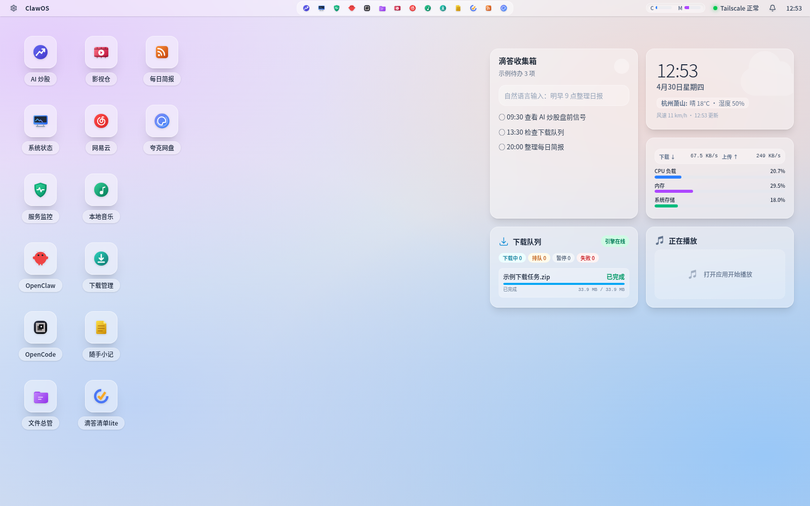
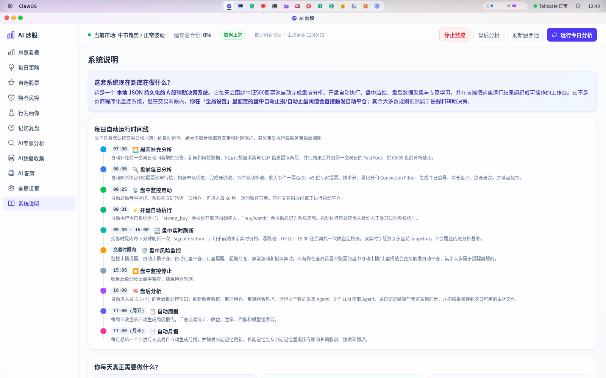

<div align="center">


# ClawOS

### Your Personal Cloud Desktop, Running in a Browser

[](LICENSE)
[](https://nodejs.org/)
[](https://react.dev/)
[](https://www.typescriptlang.org/)

A self-hosted Web OS that brings a desktop-like experience to your browser.  
AI-powered stock analysis, media streaming, file management, notes, RSS feeds — all in one place.

**[> 中文文档 / Chinese Docs](README.md)**



</div>

---

## AI Stock Trading: Real Results

> The following data is from the author's **real A-share (China) trading records** using the ClawOS AI Stock Analysis module (April 2026). Not backtested. Not paper-traded.

<div align="center">

<p><em>↑ ClawOS AI Stock Trading risk control panel screenshot (2026-04-13, live trading data)</em></p>
</div>

### Highlight: Market Down, AI Pick Surges +17.42%

**2026-04-13** — The A-share market was broadly declining, with the CSI 500 index down -4.67% over the past 20 days. ClawOS AI issued a **Strong Buy** signal for Tianhua New Energy (300390) — 45 AI experts voted, composite score 80.08, the Trend Trading Expert gave 99% confidence.

Result: **Tianhua New Energy surged +17.42% that day**, profitable from the moment of purchase.

> This isn't hindsight. The signal was generated pre-market, the user confirmed the trade, and the system recorded the entire decision chain.

### Performance Summary

Since system launch on 2026-04-04, **8 round-trip trades** (buy → sell) completed across 6 A-share stocks:

```
Win rate: 87.5%  (7 out of 8 trades profitable, only 1 loss)
Avg return: +1.71% per trade
Avg holding period: 2 trading days
Only loss: Hengtong Optic-Electric -4.33% (disciplined stop-loss exit)
Best single trade: Accelink Technologies +6.94%
Best single-day gain: Tianhua New Energy +17.42% (bought on 04-13)
```

### Trade-by-Trade Breakdown

| # | Stock | Code | Buy | Sell | Return | Held | Period |
|:---:|------|:------:|-------:|-------:|-------:|:----:|------|
| 1 | Accelink Tech | 002281 | 90.39 | 93.00 | **+2.89%** | 3d | 04-04 → 04-07 |
| 2 | Robotechnik | 300757 | 434.00 | 435.69 | **+0.39%** | 3d | 04-04 → 04-07 |
| 3 | GDS Holdings | 300383 | 16.48 | 17.28 | **+4.85%** | 1d | 04-07 → 04-08 |
| 4 | Tianhua New Energy | 300390 | 56.55 | 56.58 | **+0.05%** | 1d | 04-07 → 04-08 |
| 5 | Fulin Precision | 300432 | 22.29 | 22.90 | **+2.74%** | 1d | 04-07 → 04-08 |
| 6 | Hengtong Optic | 600487 | 59.99 | 57.39 | **-4.33%** | 1d | 04-09 → 04-10 |
| 7 | Accelink Tech | 002281 | 106.79 | 114.20 | **+6.94%** | 3d | 04-10 → 04-13 |
| 8 | Robotechnik | 300757 | 492.95 | 493.66 | **+0.14%** | 4d | 04-09 → 04-13 |

> **Current position**: Tianhua New Energy (300390), cost basis 73.58, current price 80.20, **unrealized +9.00%**, second take-profit level triggered.
>
> **+17.42% on the day of purchase**, surging against a declining market.

### How Does It Work?

This isn't luck — it's systematic risk discipline:

- **45 AI Experts Vote** — 30 LLM experts covering 9 dimensions (industry chain, fundamentals, macro, sentiment, etc.) + 15 rule-based experts, triple-stream weighted scoring — no single-indicator guesswork
- **Strict Stop-Loss** — Loss ≥3% triggers immediate sell. The only losing trade (Hengtong Optic) was a disciplined stop-loss exit, preventing deeper drawdown
- **Risk-First** — Major-event veto (MH1), automatic exclusion of newly-listed/suspended stocks, max 3 concurrent positions
- **Twice-Daily Data Collection** — Full collection at 16:00 post-market + incremental update at 07:30 pre-market, so overnight breaking news is never missed
- **Expert Memory System** — Three-tier memory (short/medium/long-term), experts learn from historical mistakes and don't repeat them
- **Human-AI Collaboration** — AI recommends, human decides. Every decision is recorded and fed back for learning

---

## Why ClawOS?

Most self-hosted dashboards give you a grid of bookmarks. ClawOS gives you an **actual desktop** — with draggable windows, a macOS-style dock, desktop widgets, wallpapers, and 15 integrated apps that talk to each other.

It's designed for **one person**: you. Single-user, single-machine, zero cloud dependency. Access it remotely through Tailscale or any VPN, and everything just works.

### Highlights

- **Full Desktop Shell** — Dock, window management, wallpapers, notification center, system tray
- **AI Stock Analysis** — A-share market signals, multi-expert voting, position risk control, performance replay
- **Media Center** — NetEase Cloud Music streaming, local music library, video search & HLS playback
- **Productivity Suite** — Markdown notes with rich-text editor, Dida365 (TickTick) integration, RSS daily briefings
- **File & Cloud** — FileBrowser for local files, Baidu & Quark cloud drives via AList
- **System Monitor** — Real-time CPU/RAM/disk/network widgets, systemd service health dashboard
- **Downloads** — Aria2-powered download manager with speed display and queue management

## Architecture

```
Browser ──> ClawOS (:3001)
              ├── Static Frontend (React SPA)
              ├── REST API (/api/system/*)
              ├── Reverse Proxy ──> OpenClaw AI   (:18789)
              ├── Reverse Proxy ──> FileBrowser    (:18790)
              └── RPC Calls     ──> Aria2          (:6800)
                                ──> AList          (:5244)
```

| Layer | Stack |
|---|---|
| **Frontend** | React 19 + Vite 8 + TypeScript + Tailwind CSS 4 + Zustand + Framer Motion |
| **Backend** | Node.js + Express 5 + TypeScript + Winston logging |
| **Editor** | Tiptap (rich-text note editor) |
| **Integrations** | OpenClaw, FileBrowser, AList, Aria2, NetEase Music API, AKShare (Python) |

## Quick Start

### Prerequisites

- **OS**: Linux (Ubuntu 24.04+ recommended)
- **Node.js**: 20+
- **Python 3**: Required for AI stock analysis data collection (AKShare)
- **Optional**: Tailscale, Aria2, AList, FileBrowser, OpenClaw

### 1. Clone & Install

```bash
git clone https://github.com/gumustudio/ClawOS.git
cd ClawOS
npm install --prefix frontend
npm install --prefix backend
```

### 2. Configure

```bash
# Set login password (Basic Auth, username is always "clawos")
mkdir -p ~/.clawos
echo "CLAWOS_PASSWORD=your_password" > ~/.clawos/.env
```

### 3. Build & Run

```bash
# Build both frontend and backend
./scripts/build.sh

# Development mode (hot reload)
./scripts/start-dev.sh
# Frontend: http://localhost:5173
# Backend:  http://localhost:3001

# Production mode (systemd service)
./scripts/install-systemd.sh
# Access: http://localhost:3001
```

## Apps

| App | Description |
|---|---|
| **AI Quant** | A-share market signals, multi-model expert voting, position management, risk control, memory & replay |
| **System Status** | Real-time CPU/RAM/disk/network monitoring as desktop widgets |
| **Service Monitor** | Health dashboard for all systemd services |
| **OpenClaw** | Embedded AI gateway via reverse proxy (zero-invasion to the original project) |
| **File Manager** | FileBrowser integration for local file management |
| **Video** | MacCMS source search + HLS online playback |
| **NetEase Music** | NetEase Cloud Music streaming with VIP cookie support |
| **Local Music** | Local music library scanning, playback, and lyrics display |
| **Downloads** | Aria2 RPC-based download task manager |
| **Notes** | Local Markdown notes with folders, rich-text editing, and image support |
| **Dida Lite** | Dida365 (TickTick) OAuth integration with task management & calendar view |
| **Daily Brief** | Local RSS feed import, deduplication, categorization, and briefing generation |
| **Cron Jobs** | Visual panel for backend scheduled tasks |
| **Cloud Drives** | Baidu & Quark cloud drives via AList proxy |

## Desktop Features

- **Window Management** — macOS-style windows with red/yellow/green buttons, maximize/restore, minimize to dock
- **Dock** — Auto-hide, resizable (32–80px), hover animation, running-app indicators
- **Widgets** — Dida todo list (with natural language input), clock & calendar, system resources, download queue, now-playing music
- **Notification Center** — Backend-persisted notifications with SSE push and toast alerts
- **Wallpapers** — Multiple wallpaper choices with blur effect when apps are open
- **Settings** — Personalization, download paths, account authorization, system info

## Configuration

### Environment Variables

| Variable | Source | Description |
|---|---|---|
| `CLAWOS_PASSWORD` | `~/.clawos/.env` | Login password for Basic Auth (username: `clawos`) |
| `OPENCLAW_GATEWAY_TOKEN` | `~/.openclaw/.env` | OpenClaw gateway authentication token |
| `PORT` | env | Backend listen port (default: `3001`) |
| `DIDA_CLIENT_ID` / `DIDA_CLIENT_SECRET` | env | Dida365 OAuth credentials |
| `BAIDU_NETDISK_CLIENT_ID` / `BAIDU_NETDISK_CLIENT_SECRET` | env | Baidu Netdisk OAuth credentials |

### Path Configuration

All working directories are configurable via the Settings UI or `~/.clawos/config.json`:

```json
{
  "paths": {
    "downloadsDir": "~/Downloads",
    "musicDownloadsDir": "~/Music",
    "notesDir": "~/Documents/Notes",
    "readerDir": "~/Documents/RSS",
    "stockAnalysisDir": "~/Documents/StockAnalysis",
    "videoDownloadsDir": "~/Videos"
  }
}
```

## Authentication

- All routes are protected by **HTTP Basic Auth** (username: `clawos`)
- Frontend includes a built-in login screen
- FileBrowser proxy uses a secondary cookie-based auth (`clawos_filebrowser_auth`)
- Local music streaming uses cookie auth (`clawos_media_auth`) since `<audio>` tags can't send Auth headers
- If `CLAWOS_PASSWORD` is not set, auth is skipped (local development only)

## External Services

All external services are **optional**. The core desktop and apps work without them.

| Service | Port | Purpose |
|---|---|---|
| Aria2 | 6800 | Download engine |
| AList | 5244 | Cloud drive mounting (Baidu/Quark) |
| FileBrowser | 18790 | Local file management UI |
| OpenClaw | 18789 | AI chat gateway |

## systemd Services

`install-systemd.sh` sets up user-level services:

| Service | Description |
|---|---|
| `clawos.service` | Main backend (Node.js) |
| `clawos-filebrowser.service` | FileBrowser instance |
| `clawos-watchdog.timer` | Health check every 10 min, auto-restart on failure |
| `clawos-display-inhibit.service` | Prevent display sleep for remote access |

## Testing

```bash
# Backend tests
npm --prefix backend test

# Frontend tests
npm --prefix frontend test

# Type checking only
npx --prefix frontend tsc --noEmit
npx --prefix backend tsc --noEmit
```

## Project Structure

```
ClawOS/
├── frontend/           # React SPA
│   ├── src/
│   │   ├── apps/       # App components (AIQuant, Notes, Music, etc.)
│   │   ├── components/ # Shared UI (NotificationCenter, Dock, Widgets)
│   │   ├── store/      # Zustand global state
│   │   ├── lib/        # Utilities (notifications SDK, server config)
│   │   └── App.tsx     # Desktop shell + app registry
│   └── public/         # Static assets (wallpapers, icons)
├── backend/
│   ├── src/
│   │   ├── routes/     # Express routes
│   │   ├── services/   # Business logic (stock-analysis, reader, notifications)
│   │   ├── utils/      # Utilities (config, logger, probe)
│   │   └── server.ts   # Entry: auth, proxy, static serving
│   └── tests/          # Backend test suite
├── scripts/            # Build, deploy, systemd install scripts
└── filebrowser/        # FileBrowser assets
```

## FAQ

**Can I use it without Aria2/AList/OpenClaw?**  
Yes. These are optional integrations. The corresponding features will show as unavailable, but everything else works fine.

**How do I access it remotely?**  
The backend binds to `127.0.0.1:3001` by default (no external exposure). Use Tailscale, WireGuard, or a reverse proxy for remote access.

**How do I update?**  
```bash
git pull
./scripts/build.sh
systemctl --user restart clawos.service
```

## License

This project is licensed under the [GNU General Public License v3.0](LICENSE).

<div align="center">

---

Built with care by [gumustudio](https://github.com/gumustudio)

</div>
